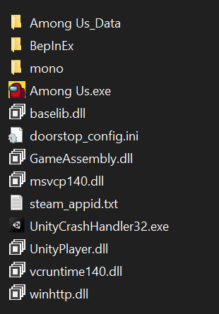

# Peasmod
### _A mod that aims to add new roles and abilities to the game to enhance the gameplay_

  

Play with the classic roles and gamemodes. Currently it contains 13 roles and 3 gamemodes and more to come!

# Releases
| Mod Version| Game Version | Link |
|----------|-------------|-----------------|
| 2021.11.9.5s| 3.0.0-pre1| [Download](https://github.com/Peasplayer/Peasmod/releases/download/3.0.0-pre1/Peasmod.zip)
| 2021.6.30s| 2.1.6| [Download](https://github.com/Peasplayer/Peasmod/releases/download/2.1.6/Peasmod.zip)
| 2021.6.15s| 2.1.4| [Download](https://github.com/Peasplayer/Peasmod/releases/download/2.1.4/Peasmod-2.1.4.zip)
| 2021.5.25s| 2.1.3| [Download](https://github.com/Peasplayer/Peasmod/releases/download/2.1.3/Peasmod-2.1.3.zip)
| 2021.5.10s| 2.1.2| [Download](https://github.com/Peasplayer/Peasmod/releases/download/2.1.2/Peasmod-2.1.2.zip)
| 2021.4.12s| 2.1.1| [Download](https://github.com/Peasplayer/Peasmod/releases/download/2.1.1/Peasmod-2.1.1.zip)
| 2021.4.12s| 2.1.0| [Download](https://github.com/Peasplayer/Peasmod/releases/download/2.1.0/Peasmod-2.1.0.zip)
| 2020.12.9s| 2.0.0| [Download](https://github.com/Peasplayer/Peasmod/releases/download/2.0.0/Peasmod.zip)

> **Note**: All versions below 2.0.0 are buggy and should not be used at all. All versions below 3.0.0 are badly written and buggy. They can be used but it's not recomended.
# GameModes
## BattleRoyale
Everyone against everyone! Your goal is to kill everyone else and be the last one standing.
## Hide and Seek
Hide from the seekers! The hiders get a head start before the seekers have a certain time to find them. The seekers win if they manage to find every player and kill them, the hiders win if the time rans out. For balancing purposes, the seeker is a bit faste so watch out!
## God Impostor
This is probably the highlight of the mod. One impostor gets many cool new abilities, such as morphing, building vents, dragging bodies, going invisible and freezing everyone. All the other non impostor roles are also playable in this gamemode.

# Roles

## Neutral Roles
- [Jester](#jester)
- [Troll](#troll)
## Crewmate Roles
- [Captain](#captain)
- [Demon](#demon)
- [Doctor](#doctor)
- [Inspector](#inspector)
- [Mayor](#mayor)
- [Sheriff](#sheriff)
## Impostor Roles
- [Builder](#builder)
- [Glaciater](#glaciater)
- [Janitor](#janitor)
- [Ninja](#ninja)
- [Undertaker](#undertaker)

# Installation
## Automatic installation on Windows
### ModManager
You can install Peasmod by using [ModManager](https://github.com/MatuxGG/ModManager) from Matux. A detailed explanation on how to install MM and how to use it to install Peasmod can be found [here](https://github.com/MatuxGG/ModManager#how-to-install).
### Peasmod-Installer
You can also use my installer, wich is still in the beta version. You need [.NET](https://dotnet.microsoft.com/en-us/download/dotnet/5.0) installed to make it work. The installer can be downloaded [here](https://cdn.discordapp.com/attachments/618327580470411274/920330858844532746/Peasmod-Installer.exe).
## Manual installation on Windows
Download the Peasmod.zip from the release you want to install. Extract that file in your Among Us directory (if you have the game on steam the path is "C:\Program Files (x86)\Steam\steamapps\common\Among Us", on epic games it's "C:\Program Files\Epic Games\AmongUs"). Afterwards there should be added a "BepInEx" and a "mono" folder as well as 2 files named "doorstop_config.ini" and "winhttp.dll".

In order to uninstall the mod again remove those files and folders.

## Credits
- [Reactor](https://github.com/NuclearPowered/Reactor) - The framework for the mod
- [BepInEx](https://github.com/BepInEx/BepInEx) - The used Unity game patcher 
- [Essentials](https://github.com/DorCoMaNdO/Reactor-Essentials) - Used for custom game options in version before 3.0.0
- [Plix](https://github.com/amsyarasyiq) - [PeasAPI](https://github.com/Peasplayer/PeasAPI) and helped me
- [Pandapip](https://github.com/Pandapip1) - [PeasAPI](https://github.com/Peasplayer/PeasAPI) and helped me
- (Discord) @Sam.#0006 - Cosmetics
- (Discord) @C.A 100 PRO PLAYER#4147 - Textures
- [Hindenburg (Edward)](https://github.com/skeldjs/Hindenburg) - Server software for Peaspowered
- [Matux](https://github.com/Matuxgg) - Using his server
- [Daemon](https://github.com/DaemonBeast) - Helped me
- [Toasty](https://github.com/ToastyMarshmallow) - Helped me
- [funnynumber](https://github.com/gabriel-nsiqueira) - Helped me
- [Aeolic](https://github.com/Aeolic) - Helped me
- [Przebor](https://github.com/przebor) - Helped me

## Disclaimer
*This mod is not affiliated with Among Us or Innersloth LLC, and the content contained therein is not endorsed or otherwise sponsored by Innersloth LLC. Portions of the materials contained herein are property of Innersloth LLC. © Innersloth LLC.*

## License
AGPL-3.0
